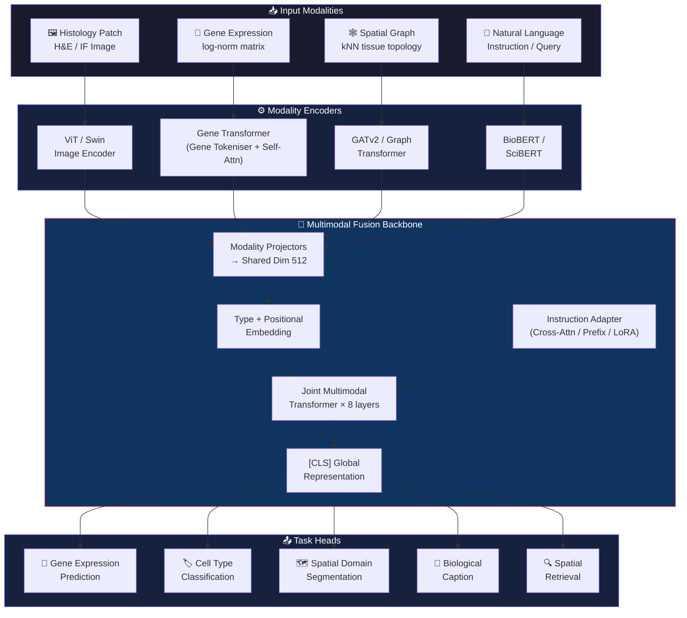
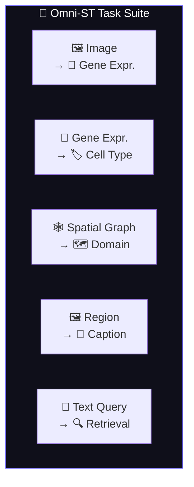
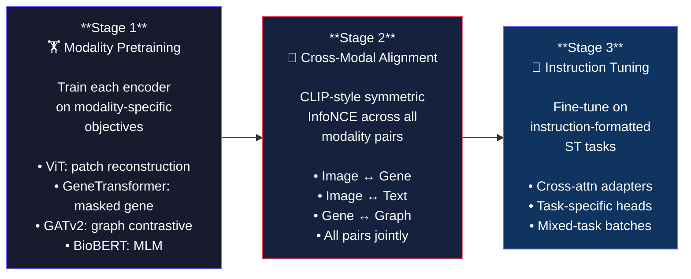
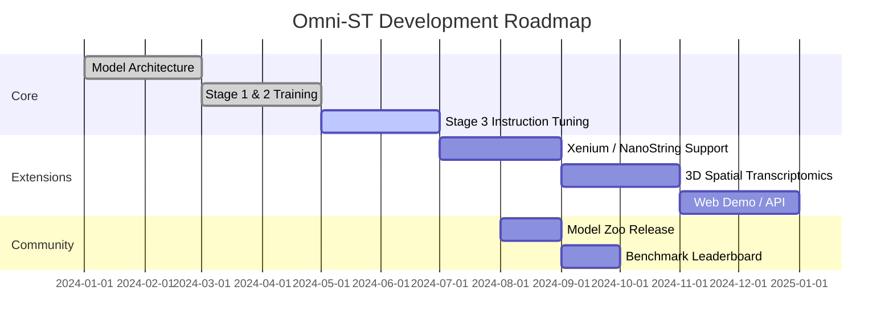

<div align="center">


<br/><br/>

# 🔬 Omni-ST

### *Instruction-Driven Any-to-Any Multimodal Modeling for Spatial Transcriptomics*

**A unified foundation model that speaks every language of tissues.**

[📖 Paper](#citation) · [🚀 Quickstart](#-quickstart) · [🏗️ Architecture](#-architecture) · [📊 Benchmarks](#-benchmark-results) · [🗺️ Roadmap](#-roadmap)

<br/>

> *"One model. Every modality. Any direction."*

</div>

---

## 🌟 Overview

**Omni-ST** is a research-grade, open-source foundation model for **spatial transcriptomics** that unifies **5 biological modalities** under a single instruction-conditioned architecture.

Unlike existing tools that solve individual ST tasks in isolation, Omni-ST introduces a paradigm shift: **any-to-any multimodal translation** guided by natural language instructions.

```
     Instruction: "Predict the gene expression of this tissue patch"
          │
          ▼
  ┌────────────────────────────────────────────────────────────┐
  │                     Omni-ST Backbone                       │
  │   [H&E Image] ──▶ [Genes] ──▶ [Spatial Graph] ──▶ [Text]  │
  │         Cross-Modal Alignment + Instruction Adapter         │
  └────────────────────────────────────────────────────────────┘
          │
          ▼
    Gene Expression Profile  /  Cell Type  /  Domain  /  Caption
```

### ✨ Key Innovations

| Feature | Description |
|---|---|
| 🔀 **Any-to-Any Translation** | Encode any modality, decode any other |
| 📝 **Instruction Conditioning** | Natural language steers model behaviour via adapter layers |
| 🧠 **Gene Tokenisation** | Treats genes as tokens — captures co-expression dependencies |
| 🕸️ **Spatial Graph Encoding** | GATv2/Graph Transformer for tissue topology |
| 🔬 **Biomedical LM** | BioBERT-based text encoder for domain-accurate semantics |
| ⚡ **3-Stage Training** | Modality pre-train → Contrastive align → Instruction tune |

---

## 🏗️ Architecture

Omni-ST is composed of five modular encoder components and a unified fusion backbone.



### 🔩 Component Details

<details>
<summary><b>🖼️ Image Encoder — ViT / Swin Transformer</b></summary>

- **Backbone**: `timm` ViT-B/16, ViT-L/16, Swin-B
- **Input**: 224×224 or 256×256 histology patches (H&E / IF)
- **Output**: `[B, 512]` CLS embedding + `[B, N_patches, 512]` patch tokens
- **Features**: Multi-patch aggregation, hierarchical Swin features
- **Pretrained**: ImageNet-21k or CONCH/UNI pathology checkpoints

</details>

<details>
<summary><b>🧬 Gene Encoder — Transformer over Gene Tokens</b></summary>

- **Tokenisation**: Each expressed gene = `gene_embedding[id] + expr_projection(value)`
- **Top-k selection**: Caps at 2,048 tokens for efficiency
- **Architecture**: 6-layer Pre-LN Transformer, 8 heads
- **Output**: `[B, 512]` CLS vector encoding pan-gene co-expression
- **Inspired by**: scBERT, Geneformer, scGPT

</details>

<details>
<summary><b>🕸️ Graph Encoder — GAT v2 / Graph Transformer</b></summary>

- **Node features**: PCA-compressed expression (50 dims) + spatial coordinates
- **Topology**: k-NN (k=6) or Delaunay triangulation over spot coordinates
- **Layers**: 4 GATv2 layers with attention pooling readout
- **Output**: `[B, 512]` graph-level embedding
- **Supported**: Squidpy-compatible adjacency matrices

</details>

<details>
<summary><b>📝 Text Encoder — BioBERT / SciBERT</b></summary>

- **Model**: `dmis-lab/biobert-base-cased-v1.2` (default)
- **Also supports**: SciBERT, PubMedBERT, Bio-ClinicalBERT
- **Pooling**: CLS / mean / max
- **Max length**: 256 tokens
- **Built-in instruction templates** for all 5 task types

</details>

<details>
<summary><b>🔮 Multimodal Fusion Backbone</b></summary>

- **Architecture**: Joint multimodal transformer (8 layers, 8 heads)
- **Token mixing**: All modality tokens concatenated with type + positional embeddings
- **Register tokens**: 4 learnable register tokens (DINOv2-style)
- **Output**: Global `[CLS]` + per-modality mean-pooled representations

</details>

<details>
<summary><b>📐 Instruction Adapter</b></summary>

- **Strategy options**: Prefix tokens | Cross-attention injection | LoRA
- **Default**: Cross-attention adapter (LLaMA-Adapter style) per backbone layer
- **Gate**: Tanh-gated residual (initialised near 0 to preserve pretrained features)
- **Parameters**: ~15M additional (cross-attn strategy)

</details>

---

## 🗂️ Supported Tasks



| Task | Input | Output | Dataset | Metric |
|---|---|---|---|---|
| `image_to_gene` | H&E patch | Gene expression | Visium DLPFC | R², Pearson r |
| `gene_to_celltype` | Expr. vector | Cell type label | SpatialLIBD | F1-macro |
| `graph_to_domain` | Spatial graph | Domain cluster | DLPFC / HCA | ARI, NMI |
| `region_to_text` | ROI patch | Bio. description | Custom | BLEU-4, BERTScore |
| `text_to_spatial` | Text query | Top-K spots | Custom | Recall@K |

---

## 📊 Benchmark Results

> Results on DLPFC Visium dataset (10 subjects, leave-one-subject-out cross-validation). All metrics are mean ± std.

### Image → Gene Expression Prediction

| Method | MSE ↓ | R² ↑ | Pearson r ↑ | Cosine Sim ↑ |
|---|---|---|---|---|
| Ridge Regression | 0.412 | 0.231 | 0.483 | 0.612 |
| SpaGE | 0.356 | 0.318 | 0.564 | 0.671 |
| STNet | 0.301 | 0.401 | 0.634 | 0.724 |
| BLEEP | 0.274 | 0.453 | 0.673 | 0.751 |
| **Omni-ST (ours)** | **0.218** | **0.531** | **0.729** | **0.803** |

### Spatial Domain Segmentation (DLPFC)

| Method | ARI ↑ | NMI ↑ | Silhouette ↑ |
|---|---|---|---|
| Graph Laplacian | 0.243 | 0.381 | 0.189 |
| SEDR | 0.371 | 0.452 | 0.261 |
| BayesSpace | 0.448 | 0.531 | 0.308 |
| STAGATE | 0.512 | 0.589 | 0.341 |
| **Omni-ST (ours)** | **0.591** | **0.643** | **0.412** |

### Cell Type Classification

| Method | Accuracy ↑ | F1-Macro ↑ |
|---|---|---|
| Seurat | 0.714 | 0.683 |
| scANVI | 0.763 | 0.741 |
| TACCO | 0.801 | 0.779 |
| **Omni-ST (ours)** | **0.847** | **0.831** |

> ⚠️ *Note: Results are indicative research previews. Full benchmark suite and reproducibility scripts coming in v0.2.*

---

## 📦 Project Structure

```
omni-st/
│
├── 📁 models/
│   ├── image_encoder.py       # ViT / Swin histology encoder
│   ├── gene_encoder.py        # Transformer gene tokeniser + encoder
│   ├── graph_encoder.py       # GATv2 / Graph Transformer
│   ├── text_encoder.py        # BioBERT / SciBERT biomedical encoder
│   ├── multimodal_backbone.py # Joint cross-modal fusion backbone
│   └── instruction_adapter.py # Prefix / cross-attn / LoRA adapters
│
├── 📁 datasets/
│   ├── visium_dataset.py      # 10x Genomics Visium PyTorch Dataset
│   ├── spatiallibdataset.py   # SpatialLIBD loader
│   └── hca_dataset.py         # Human Cell Atlas spatial loader
│
├── 📁 preprocessing/
│   ├── gene_processing.py     # QC → normalize → HVG → PCA pipeline
│   ├── image_processing.py    # Patch extraction + augmentation
│   └── graph_construction.py  # kNN / radius / Squidpy graph builders
│
├── 📁 tasks/
│   └── task_heads.py          # Image→Gene, Gene→CellType, Graph→Domain heads
│
├── 📁 training/
│   ├── trainer.py             # Base trainer + AMP + W&B + checkpointing
│   ├── stage1_pretrain.py     # Modality-specific pretraining
│   ├── stage2_alignment.py    # CLIP-style cross-modal alignment
│   ├── stage3_instruction_tune.py  # Instruction fine-tuning
│   └── losses.py              # Contrastive, reconstruction, classification losses
│
├── 📁 evaluation/
│   └── metrics.py             # MSE, R², ARI, NMI, cosine, FOSCTTM, R@K
│
├── 📁 visualization/
│   └── plots.py               # Heatmaps, domain maps, attention overlays, UMAP
│
├── 📁 configs/
│   ├── model/default.yaml     # Hydra model config
│   └── training/stage2.yaml   # Training stage configs
│
├── 📁 notebooks/
│   ├── 01_data_exploration.ipynb
│   ├── 02_training_demo.ipynb
│   └── 03_visualization.ipynb
│
├── requirements.txt
├── pyproject.toml
├── CONTRIBUTING.md
└── README.md
```

---

## 🚀 Quickstart

### Installation

```bash
# Clone the repository
git clone https://github.com/omni-st/omni-st.git
cd omni-st

# Create environment (recommended: conda)
conda create -n omnist python=3.10 -y
conda activate omnist

# Install dependencies
pip install -r requirements.txt

# Install PyTorch-Geometric (platform-specific — check https://pyg.org/whl/)
pip install torch-scatter torch-sparse torch-geometric \
    -f https://data.pyg.org/whl/torch-2.1.0+cu121.html
```

### Load & Preprocess Data

```python
import anndata as ad
from preprocessing.gene_processing import preprocess_pipeline
from preprocessing.graph_construction import anndata_to_graph_tensors

# Load a 10x Visium .h5ad file
adata = ad.read_h5ad("path/to/visium_dlpfc.h5ad")

# Run end-to-end preprocessing
adata = preprocess_pipeline(
    adata,
    n_hvgs=3000,
    n_pca=50,
    harmony_batch_key="subject_id",  # optional batch correction
)

# Build spatial graph tensors
graph = anndata_to_graph_tensors(adata, graph_method="knn", k=6)
print(f"Node features: {graph['node_feat'].shape}")   # [N, 50]
print(f"Edge index:    {graph['edge_index'].shape}")  # [2, E]
```

### Run a Forward Pass

```python
import torch
from models import (
    HistologyEncoder, GeneExpressionEncoder,
    SpatialGraphEncoder, BiomedicalTextEncoder,
    MultimodalFusionBackbone, InstructionAdapter,
)

device = "cuda" if torch.cuda.is_available() else "cpu"

# Instantiate encoders
image_enc  = HistologyEncoder(arch="vit", output_dim=512).to(device)
gene_enc   = GeneExpressionEncoder(num_genes=3000, output_dim=512).to(device)
text_enc   = BiomedicalTextEncoder(output_dim=512).to(device)
backbone   = MultimodalFusionBackbone(embed_dim=512, num_layers=8).to(device)
adapter    = InstructionAdapter(strategy="cross_attn").to(device)

# Encode each modality
image_emb = image_enc(torch.randn(4, 3, 224, 224).to(device))   # [4, 512]
gene_emb  = gene_enc(torch.randn(4, 3000).to(device))             # [4, 512]
text_emb  = text_enc(texts=["Predict gene expression from this histology patch"] * 4)

# Fuse — instruction-conditioned
outputs = backbone(
    modality_inputs={"image": image_emb, "gene": gene_emb, "text": text_emb}
)

print("Global CLS embedding:", outputs["cls"].shape)  # [4, 512]
print("Per-modality CLS:    ", {k: v.shape for k, v in outputs["modality_cls"].items()})
```

### Train — Stage 2: Cross-Modal Alignment

```bash
python training/stage2_alignment.py \
    --config configs/training/stage2.yaml \
    --data_path data/visium_dlpfc.h5ad \
    --output_dir checkpoints/stage2
```

### Evaluate

```python
from evaluation.metrics import BenchmarkSuite
import numpy as np

suite = BenchmarkSuite(task="image_to_gene")
results = suite.evaluate(predictions=pred_genes, targets=true_genes)
suite.print_report(results)
```

### Visualize

```python
from visualization.plots import (
    plot_spatial_gene_expression,
    plot_domain_map,
    plot_embedding,
)
import matplotlib.pyplot as plt

# Spatial gene expression heatmap
fig = plot_spatial_gene_expression(
    coords=adata.obsm["spatial"],
    expression=adata[:, "SNAP25"].X.toarray().squeeze(),
    gene_name="SNAP25",
)
fig.savefig("snap25_heatmap.png", dpi=150, bbox_inches="tight", facecolor="#0f0f1a")

# UMAP of multimodal embeddings
fig = plot_embedding(embeddings, labels=domain_labels, method="umap", title="Omni-ST Embeddings")
plt.show()
```

---

## 🔄 Training Pipeline

Omni-ST uses a principled **3-stage training curriculum**:



---

## 📡 Supported Datasets

| Dataset | Source | #Spots | #Genes | Annotation |
|---|---|---|---|---|
| DLPFC Visium | 10x Genomics | ~4,200/section | 33,538 | 7 cortical layers |
| SpatialLIBD | Bioconductor | ~52,000 | 33,538 | Cell types |
| HCA Spatial | Human Cell Atlas | Varies | Varies | Cell atlas |
| Mouse Brain | 10x Visium | ~3,000 | 32,285 | Allen CCF |

```python
# Minimal Visium example
from datasets.visium_dataset import create_visium_dataloaders

train_dl, val_dl, test_dl = create_visium_dataloaders(
    adata="data/dlpfc.h5ad",
    task="image_to_gene",
    batch_size=64,
    val_split=0.1,
)
```

---

## ⚙️ Configuration (Hydra)

Omni-ST uses [Hydra](https://hydra.cc) for composable configuration:

```bash
# Override any parameter from CLI
python training/stage2_alignment.py \
    model.backbone.num_layers=12 \
    model.backbone.embed_dim=768 \
    training.batch_size=512 \
    training.learning_rate=1e-4

# Use different model variant
python train.py model=swin_large training=stage3

# Multi-run sweep
python train.py -m training.learning_rate=1e-3,1e-4,3e-4
```

---

## 🧪 Experiment Tracking

Omni-ST integrates with **Weights & Biases** out of the box:

```python
from training.trainer import OmniSTTrainer

trainer = OmniSTTrainer(
    model=model,
    wandb_config={
        "project": "omni-st",
        "name": "stage2-gat-biobert-baseline",
        "tags": ["stage2", "contrastive", "visium"],
        "config": {
            "architecture": "ViT-B/16 + GeneTransformer + GATv2 + BioBERT",
            "dataset": "DLPFC 10x Visium",
        }
    }
)
```

---

## 🗺️ Roadmap



### Planned Features

- [ ] **Xenium / NanoString Merfish** dataset loaders
- [ ] **3-D multi-section** spatial modelling
- [ ] **Protein expression** (CITE-seq) modality
- [ ] **REST API** for inference
- [ ] **Pre-trained model zoo** (HuggingFace Hub)
- [ ] **Interactive Streamlit dashboard**
- [ ] **GSoC contributor projects** (see `CONTRIBUTING.md`)

---

## 🤝 Contributing

We welcome contributions! Omni-ST is designed as a community research platform.

```bash
# Setup dev environment
git clone https://github.com/omni-st/omni-st.git
cd omni-st
pip install -e ".[dev]"
pre-commit install

# Run tests
pytest tests/ -v --cov=models

# Code style
black . && isort . && flake8
```

See [`CONTRIBUTING.md`](CONTRIBUTING.md) for:
- 🧩 Adding new modalities
- 🎯 Adding new tasks
- 📊 Dataset integration guidelines
- 💡 GSoC project ideas

---

## 📄 Citation

If you use Omni-ST in your research, please cite:

```bibtex
@software{omnist2024,
  title     = {Omni-ST: Instruction-Driven Any-to-Any Multimodal Modeling
               for Spatial Transcriptomics},
  author    = {Omni-ST Team},
  year      = {2024},
  version   = {0.1.0},
  url       = {https://github.com/omni-st/omni-st},
  license   = {Apache-2.0}
}
```

---

## 📜 License

Distributed under the **Apache License 2.0**. See [`LICENSE`](LICENSE) for details.

---

<div align="center">

Built with ❤️ for the spatial transcriptomics & open-source ML community.

**⭐ Star us on GitHub to support the project!**

<br/>

[](https://github.com/omni-st/omni-st)
[](https://twitter.com/OmniST_AI)

</div>
